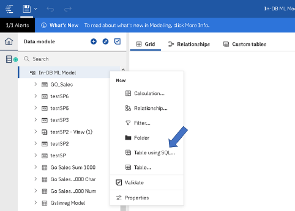
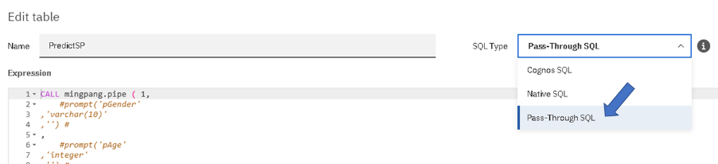
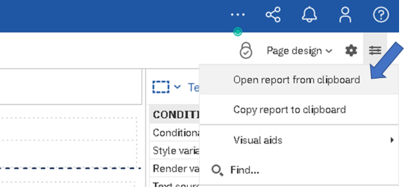

# Instructions

This folder contains assets that will allow Db2 customers to use in-Db2 machine learning functionality for single row scoring inside the database.

## Table of Contents
1. [Prerequisites](#Prerequisites)
2. [Create the scoring pipeline stored procedure](#CreateSP)
3. [Calling the stored procedure from Cognos Analytics](#Cognos)
4. [Other resources](#Resources)

## 1. Prerequisites <a name="Prerequisites"></a>

You must meet the following requirements to use the machine learning functionality in Db2:
- Enable IDAX Stored Procedures for ML in your Db2 instance
- Have a linear regression model trained based on the GoSales dataset

### 1.1 Enable IDAX Stored Proceduces for ML in your Db2 instance
Please follow the documentation [here](https://www.ibm.com/support/knowledgecenter/SSEPGG_11.5.0/com.ibm.db2.luw.ml.doc/doc/ml_prereqs.html) to enable ML functionality in your Db2 instance.

### 1.2 Train a linear regression model to predict the PURCHASE_AMOUNT using the GoSales dataset

Please follow the steps provided [here](../Building%20ML%20Models%20with%20Db2/README.md) to download the GoSales dataset and load it into your Db2 database. Then use this [notebook](../Building%20ML%20Models%20with%20Db2/Notebooks/Regression_Demo.ipynb) to pre-process the data, collect and store the statistics, train and deploy a linear regression model in your database.

Once you take these steps, verify that the following tables are created and contain values:
- GO_SALES_SUM1000_NUM (statistics for the numerical columns)
- GO_SALES_SUM1000_CHAR (statistics for the nominal columns)
- GSLINREG_MODEL (model table)

## 2. Create the scoring pipeline stored procedure <a name="CreateSP"></a>
### 2.1 Copy the stored procedure file

Copy the file [scoring_pipeline](scoring_pipeline) to your working directory. The steps needed to write the code in this file in described in this demo.

### 2.2 Create the stored procedure
Execute the following command to create or update the stored procedure:

```
db2 -td@ -vf scoring_pipeline
```

The @ after -td option indicates the last character in the file, which is called the terminating character. The -v option indicates using the optional verbosity which will cause each SQL statement or command in the script to be displayed to the screen as it is run, along with any output that results from its execution. The -f option indicates that the target of the command is a file.

### 2.3 Authorize the users who need to execute the pipeline 
Once the stored procedure is created, we can call it from either Db2 command line or from a third-party application that is connected to the database, using credentials with the proper authorizations. Specifically, the credentials used must have the EXECUTE privilege on the created stored procedure. Execute the following command to grant execute privilege to `<user_name>` on your stored procedure `<scoring_sp_name>` :

```
db2 "grant execute on procedure <scoring_sp_name> to user <user_name>"
```

### 2.4 Test your stored procedure
Call your stored procedure using the following command:
db2 "call pipe(1, 'M', 45, 'Single', NULL, 0, NULL)"

You should see the result printed like this:

```

  Result set 1
  --------------

  PURCHASE_AMOUNT
  ------------------------
    +1.21634933813948E+002

  1 record(s) selected.

  Return Status = 0

```

## 3. Calling the stored procedure from Cognos Analytics <a name="Cognos"></a>

We use Cognos Analytics platform in this demo, but this solution would generalize to different applications that need to interact with Machine Learning models from Db2. In any other use-cases, you would need to: 
1)	Establish a connection to your Db2 database
2)	Call the stored procedure by passing the input parameters
3)	Retrieve and use the result which is returned as a table with PURCHASE_AMOUNT as the only column.

In this demo we call the scoring pipeline from a Cognos Analytics report that connects to Db2 using a JDBC connection. The dashboard receives the input parameters from the user and passes them to the stored procedure. The stored procedure computes and returns the result that is then presented to the user in the dashboard. The following sections describe the steps needed to implement this solution in Cognos Analytics.

### 3.1. Create a connection to your Db2 database
Follow the instructions provided [here](https://www.ibm.com/support/knowledgecenter/SSEP7J_11.1.0/com.ibm.swg.ba.cognos.ug_cra.doc/c_db2_ds.html#DB2_ds) to create a data source connection in your Cognos Analytics environment.

### 3.2. Create a data module
Follow the instructions provided [here](https://www.ibm.com/support/knowledgecenter/SSEP7J_11.0.0/com.ibm.swg.ba.cognos.ca_mdlg.doc/t_ca_mldg_src_dataserver.html) to create a data module using the connection to your Db2 database.

### 3.3. Add the scoring stored procedure to your data module
In your data module, take the following steps to add the scoring stored procedure. In your data module, click on the “…” right to the data module root node. From the menu select *New Table using SQL…* 



In the *Edit Table* window, add the following command to the *Expression* box:

```
CALL <scoring_sp_name>( 1,
    #prompt('pGender'
,'varchar(10)'
,'') #
,
    #prompt('pAge'
,'integer'
,'') #
,
    #prompt('pMaritalStatus'
,'varchar(50)'
,'') #
,
    #prompt('pProfession'
,'varchar(50)'
,'') #
,
    #prompt('pIsTent'
,'smallint'
,'') #
,
    #prompt('pProductLine'
,'varchar(50)'
,'') #

) ;
```

In the above command, replace `<scoring_sp_name>` with your stored procedure name.
The `#prompt()#` blocks make the command parametric so that the input values can be passed from a report. 
In `#prompt(<param1>,<param2>,<param3>)# `, `<param1>` is the parameter name which will be used for authoring a report,  `<param2>` is the data type as declared in the stored procedure, and `<param3>` is the default value to be passed. Let us call this table *PredictSP*.

### 3.5. Set the SQL Type
From the SQL Type drop down menu select “Pass-Through SQL”. Click OK. Click Save.



### 3.6. Add the table containing the training data
In your data module, add the table from your database that contains the training data. Let us call this table *GO_Sales*. This table will be used to create pre-populate the prompts in the report.

### 3.7. Use the created table in a report
Open a blank report based on the data module you just created and take the following steps:
- Add the *PURCHASE_AMOUNT* from the table you created from the stored procedure *(PredictSP)* to your report as a *Singleton*. This shows the prediction returned from Db2 in your report.
- Add a *value prompt control* to your report for each input parameter. These controls receive the model input values from the user.
- For each prompt create a query that points to the relevant column of the table containing the training data (Go_Sales). Then in the *Properties* tab, choose that column as *Use Value* and *Display Value* properties. This will pre-populate the prompt when the report runs.
- Add a *Prompt button*. When the report runs, by clicking this button you pass the parameters from the prompt controls to the stored procedure.
- Click *Save*.

Alternatively, you can copy the report specification provided [here](Cognos_Report_Specs.txt) into your clipboard, and then from *More* menu(  ) select *Open report from clipboard*. Click *Save*.



## 4. Other resources <a name="Resources"></a>
Find step-by-step demonstrations for creating the scoring pipeline stored procedure here:
- Building a scoring pipeline inside Db2

Db2 Machine Learning [Documentation](https://www.ibm.com/support/knowledgecenter/SSEPGG_11.5.0/com.ibm.db2.luw.ml.doc/doc/ml_prereqs.html)
