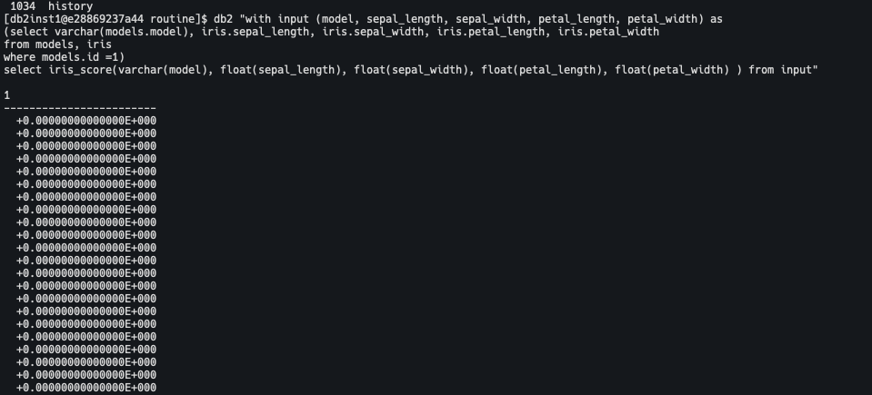
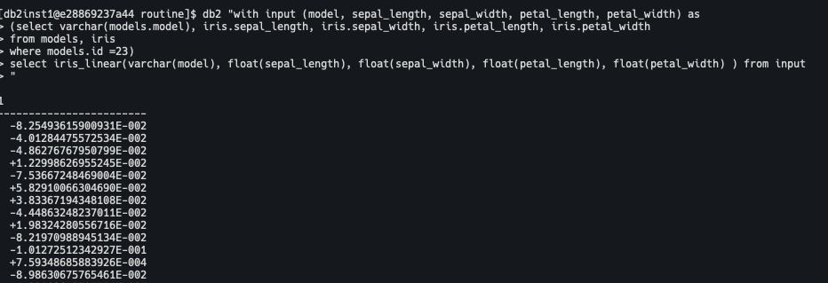

# Procedure for using db2 as a backend for model hosting

DB2's Integrated Analytics System allows for an impressive amount of user defined extensions, which can be leveraged to allow db2 to serve as a model management and scoring engine. 
We can store, manage, update and score models trained in scikit-learn and other python frameworks in DB2. We can also 
run models trained in Lua, C, R, or C++. This document will demonstrate a python based example. 

# Before you begin

Note that this tutorial involves dynamically deploying Python code to a Db2 server using pickling and other techniques which serialize python code. As such you must make sure that the version of python you use to develop the code outside of Db2 is the same as the version of python that is installed on the Db2 server. Otherwise you may experience errors. 

Example: 

1. You train a model using python 3.9 on my local machine.
2. You install Python 3.7 on the Db2 server
3. You follow the rest of this tutorial to deploy the model
4. You experience a runtime error because the python version you used to train the model is different than the python version running on the Db2 server.

You can verify the version of python you are running using the following command:

`python --version`

Note that there are signficant differences between minor versions of Python 3, which means that code written in Python 3.6 is often not compatible with the Python 3.7 or 3.5 runtimes as an example. 

# DB2 Configuration

We will need to store a python class for scoring a generic model in our DB2 server, and make some minor configuration changes. 

Log in to the db2 server. In this case the user is `db2inst1`

`source ~/.bashrc; sudo su - db2inst1`

Make sure there is a python3 installation in your server.

`sudo yum install python3`

Install scikit-learn and joblib

`pip3 install scikit-learn joblib`

Update db2 to use the correct python path

`db2 update dbm cfg using PYTHON_PATH $(which python)`

Restart the Db2 instance because PYTHON_PATH is not dynamically configurable.

`db2 connect reset;`
`db2stop`
`db2start`

Add the python class for scoring the model by writing the following python class to $DB2_HOME/function/routine/score.py


```
import nzae
from joblib import load
from io import BytesIO
import base64

class predict(nzae.Ae):
    def _setup(self):
        self.model = None

    def predict(self,data):
        model = data[0]
        if not self.model:
            self.model = load(BytesIO(base64.b64decode(model)))

        data = data[1:]
        result = self.model.predict([data])
        return float(result[0])

    def _getFunctionResult(self,row):
        price = self.predict(row)
        return price

predict.run()
```

## Model Training

We will first train a simple logistic regression model on the Iris data set. We will use joblib to pickle the
resulting model, and write it as a b64encoded string

```
from sklearn.linear_model import LogisticRegression
from sklearn import datasets
import joblib
import base64
train = datasets.load_iris().get("data")
target = datasets.load_iris().get("target")
lr = LogisticRegression(max_iter=1000)
lr = lr.fit(train, target)

joblib.dump(lr, "lr.joblib")

with open("lr.joblib", "rb") as file:
    file =  file.read()
    b64model = base64.b64encode(file)
    print(b64model)

with open("model.b64", "wb") as file:
    file.write(b64model)

```

## Model Deployment

We need a table to store the model.

```
create table models(id integer not null generated always as identity, name varchar(30), model clob, primary key(id))
```

We can now store our model as a b64encoded string in the models table.


`db2 "insert into models (name, model) values('iris_lr', 'gANjc2tsZWFybi5saW5lYXJfbW9kZWwuX2xvZ2lzdGljCkxvZ2lzdGljUmVncmVzc2lvbgpxACmBcQF9cQIoWAcAAABwZW5hbHR5cQNYAgAAAGwycQRYBAAAAGR1YWxxBYlYAwAAAHRvbHEGRz8aNuLrHEMtWAEAAABDcQdHP/AAAAAAAABYDQAAAGZpdF9pbnRlcmNlcHRxCIhYEQAAAGludGVyY2VwdF9zY2FsaW5ncQlLAVgMAAAAY2xhc3Nfd2VpZ2h0cQpOWAwAAAByYW5kb21fc3RhdGVxC05YBgAAAHNvbHZlcnEMWAUAAABsYmZnc3ENWAgAAABtYXhfaXRlcnEOTegDWAsAAABtdWx0aV9jbGFzc3EPWAQAAABhdXRvcRBYBwAAAHZlcmJvc2VxEUsAWAoAAAB3YXJtX3N0YXJ0cRKJWAYAAABuX2pvYnNxE05YCAAAAGwxX3JhdGlvcRROWA4AAABuX2ZlYXR1cmVzX2luX3EVSwRYCAAAAGNsYXNzZXNfcRZjam9ibGliLm51bXB5X3BpY2tsZQpOdW1weUFycmF5V3JhcHBlcgpxFymBcRh9cRkoWAgAAABzdWJjbGFzc3EaY251bXB5Cm5kYXJyYXkKcRtYBQAAAHNoYXBlcRxLA4VxHVgFAAAAb3JkZXJxHmgHWAUAAABkdHlwZXEfY251bXB5CmR0eXBlCnEgWAIAAABpOHEhiYiHcSJScSMoSwNYAQAAADxxJE5OTkr/////Sv////9LAHRxJWJYCgAAAGFsbG93X21tYXBxJoh1YgAAAAAAAAAAAQAAAAAAAAACAAAAAAAAAFgHAAAAbl9pdGVyX3EnaBcpgXEofXEpKGgaaBtoHEsBhXEqaB5oB2gfaCBYAgAAAGk0cSuJiIdxLFJxLShLA2gkTk5OSv////9K/////0sAdHEuYmgmiHVieAAAAFgFAAAAY29lZl9xL2gXKYFxMH1xMShoGmgbaBxLA0sEhnEyaB5oB2gfaCBYAgAAAGY4cTOJiIdxNFJxNShLA2gkTk5OSv////9K/////0sAdHE2YmgmiHVij1QYxRMZ278kWkhF2PTuP6rSkjvrIgTAaHLQY1VE8b8t3ELIwxrhP96DvoMnmtS/jiBwUXptyr84Vo+N6zjuv1uTtS3Pcby/DBhpg8Sn5L+u1KngwskFQFMOTJVlMABAWAoAAABpbnRlcmNlcHRfcTdoFymBcTh9cTkoaBpoG2gcSwOFcTpoHmgHaB9oNWgmiHVidKGKloayI0Ci4JR+q+cBQDDaL3ZxLCjAWBAAAABfc2tsZWFybl92ZXJzaW9ucTtYBQAAADEuMC4ycTx1Yi4=')"`
 
Then we register a UDF (User defined function) that references the python class.
 
```
CREATE FUNCTION iris_score(varchar(1356), float, float, float, float) \
returns float LANGUAGE PYTHON  parameter style \
NPSGENERIC  FENCED  NOT THREADSAFE  NO FINAL CALL  ALLOW PARALLEL  NO DBINFO  DETERMINISTIC  NO EXTERNAL ACTION \
RETURNS NULL ON NULL INPUT  NO SQL \
external name '/database/config/db2inst1/sqllib/function/routine/score.py'
```
Lets create a table for testing. 


```
CREATE TABLE iris(
sepal_length float
,sepal_width float
,petal_length float
,petal_width float
,iris varchar(255)
);

INSERT INTO iris
VALUES
(5.1,3.5,1.4,0.2,'setosa'),
(4.9,3,1.4,0.2,'setosa'),
(4.7,3.2,1.3,0.2,'setosa'),
(4.6,3.1,1.5,0.2,'setosa'),
(5,3.6,1.4,0.2,'setosa'),
(5.4,3.9,1.7,0.4,'setosa'),
(4.6,3.4,1.4,0.3,'setosa'),
(5,3.4,1.5,0.2,'setosa'),
(4.4,2.9,1.4,0.2,'setosa'),
(4.9,3.1,1.5,0.1,'setosa'),
(5.4,3.7,1.5,0.2,'setosa'),
(4.8,3.4,1.6,0.2,'setosa'),
(4.8,3,1.4,0.1,'setosa'),
(4.3,3,1.1,0.1,'setosa'),
(5.8,4,1.2,0.2,'setosa'),
(5.7,4.4,1.5,0.4,'setosa'),
(5.4,3.9,1.3,0.4,'setosa'),
(5.1,3.5,1.4,0.3,'setosa'),
(5.7,3.8,1.7,0.3,'setosa'),
(5.1,3.8,1.5,0.3,'setosa'),
(5.4,3.4,1.7,0.2,'setosa'),
(5.1,3.7,1.5,0.4,'setosa'),
(4.6,3.6,1,0.2,'setosa'),
(5.1,3.3,1.7,0.5,'setosa'),
(4.8,3.4,1.9,0.2,'setosa'),
(5,3,1.6,0.2,'setosa'),
(5,3.4,1.6,0.4,'setosa'),
(5.2,3.5,1.5,0.2,'setosa'),
(5.2,3.4,1.4,0.2,'setosa'),
(4.7,3.2,1.6,0.2,'setosa'),
(4.8,3.1,1.6,0.2,'setosa'),
(5.4,3.4,1.5,0.4,'setosa'),
(5.2,4.1,1.5,0.1,'setosa'),
(5.5,4.2,1.4,0.2,'setosa'),
(4.9,3.1,1.5,0.1,'setosa'),
(5,3.2,1.2,0.2,'setosa'),
(5.5,3.5,1.3,0.2,'setosa'),
(4.9,3.1,1.5,0.1,'setosa'),
(4.4,3,1.3,0.2,'setosa'),
(5.1,3.4,1.5,0.2,'setosa'),
(5,3.5,1.3,0.3,'setosa'),
(4.5,2.3,1.3,0.3,'setosa'),
(4.4,3.2,1.3,0.2,'setosa'),
(5,3.5,1.6,0.6,'setosa'),
(5.1,3.8,1.9,0.4,'setosa'),
(4.8,3,1.4,0.3,'setosa'),
(5.1,3.8,1.6,0.2,'setosa'),
(4.6,3.2,1.4,0.2,'setosa'),
(5.3,3.7,1.5,0.2,'setosa'),
(5,3.3,1.4,0.2,'setosa'),
(7,3.2,4.7,1.4,'versicolor'),
(6.4,3.2,4.5,1.5,'versicolor'),
(6.9,3.1,4.9,1.5,'versicolor'),
(5.5,2.3,4,1.3,'versicolor'),
(6.5,2.8,4.6,1.5,'versicolor'),
(5.7,2.8,4.5,1.3,'versicolor'),
(6.3,3.3,4.7,1.6,'versicolor'),
(4.9,2.4,3.3,1,'versicolor'),
(6.6,2.9,4.6,1.3,'versicolor'),
(5.2,2.7,3.9,1.4,'versicolor'),
(5,2,3.5,1,'versicolor'),
(5.9,3,4.2,1.5,'versicolor'),
(6,2.2,4,1,'versicolor'),
(6.1,2.9,4.7,1.4,'versicolor'),
(5.6,2.9,3.6,1.3,'versicolor'),
(6.7,3.1,4.4,1.4,'versicolor'),
(5.6,3,4.5,1.5,'versicolor'),
(5.8,2.7,4.1,1,'versicolor'),
(6.2,2.2,4.5,1.5,'versicolor'),
(5.6,2.5,3.9,1.1,'versicolor'),
(5.9,3.2,4.8,1.8,'versicolor'),
(6.1,2.8,4,1.3,'versicolor'),
(6.3,2.5,4.9,1.5,'versicolor'),
(6.1,2.8,4.7,1.2,'versicolor'),
(6.4,2.9,4.3,1.3,'versicolor'),
(6.6,3,4.4,1.4,'versicolor'),
(6.8,2.8,4.8,1.4,'versicolor'),
(6.7,3,5,1.7,'versicolor'),
(6,2.9,4.5,1.5,'versicolor'),
(5.7,2.6,3.5,1,'versicolor'),
(5.5,2.4,3.8,1.1,'versicolor'),
(5.5,2.4,3.7,1,'versicolor'),
(5.8,2.7,3.9,1.2,'versicolor'),
(6,2.7,5.1,1.6,'versicolor'),
(5.4,3,4.5,1.5,'versicolor'),
(6,3.4,4.5,1.6,'versicolor'),
(6.7,3.1,4.7,1.5,'versicolor'),
(6.3,2.3,4.4,1.3,'versicolor'),
(5.6,3,4.1,1.3,'versicolor'),
(5.5,2.5,4,1.3,'versicolor'),
(5.5,2.6,4.4,1.2,'versicolor'),
(6.1,3,4.6,1.4,'versicolor'),
(5.8,2.6,4,1.2,'versicolor'),
(5,2.3,3.3,1,'versicolor'),
(5.6,2.7,4.2,1.3,'versicolor'),
(5.7,3,4.2,1.2,'versicolor'),
(5.7,2.9,4.2,1.3,'versicolor'),
(6.2,2.9,4.3,1.3,'versicolor'),
(5.1,2.5,3,1.1,'versicolor'),
(5.7,2.8,4.1,1.3,'versicolor'),
(6.3,3.3,6,2.5,'virginica'),
(5.8,2.7,5.1,1.9,'virginica'),
(7.1,3,5.9,2.1,'virginica'),
(6.3,2.9,5.6,1.8,'virginica'),
(6.5,3,5.8,2.2,'virginica'),
(7.6,3,6.6,2.1,'virginica'),
(4.9,2.5,4.5,1.7,'virginica'),
(7.3,2.9,6.3,1.8,'virginica'),
(6.7,2.5,5.8,1.8,'virginica'),
(7.2,3.6,6.1,2.5,'virginica'),
(6.5,3.2,5.1,2,'virginica'),
(6.4,2.7,5.3,1.9,'virginica'),
(6.8,3,5.5,2.1,'virginica'),
(5.7,2.5,5,2,'virginica'),
(5.8,2.8,5.1,2.4,'virginica'),
(6.4,3.2,5.3,2.3,'virginica'),
(6.5,3,5.5,1.8,'virginica'),
(7.7,3.8,6.7,2.2,'virginica'),
(7.7,2.6,6.9,2.3,'virginica'),
(6,2.2,5,1.5,'virginica'),
(6.9,3.2,5.7,2.3,'virginica'),
(5.6,2.8,4.9,2,'virginica'),
(7.7,2.8,6.7,2,'virginica'),
(6.3,2.7,4.9,1.8,'virginica'),
(6.7,3.3,5.7,2.1,'virginica'),
(7.2,3.2,6,1.8,'virginica'),
(6.2,2.8,4.8,1.8,'virginica'),
(6.1,3,4.9,1.8,'virginica'),
(6.4,2.8,5.6,2.1,'virginica'),
(7.2,3,5.8,1.6,'virginica'),
(7.4,2.8,6.1,1.9,'virginica'),
(7.9,3.8,6.4,2,'virginica'),
(6.4,2.8,5.6,2.2,'virginica'),
(6.3,2.8,5.1,1.5,'virginica'),
(6.1,2.6,5.6,1.4,'virginica'),
(7.7,3,6.1,2.3,'virginica'),
(6.3,3.4,5.6,2.4,'virginica'),
(6.4,3.1,5.5,1.8,'virginica'),
(6,3,4.8,1.8,'virginica'),
(6.9,3.1,5.4,2.1,'virginica'),
(6.7,3.1,5.6,2.4,'virginica'),
(6.9,3.1,5.1,2.3,'virginica'),
(5.8,2.7,5.1,1.9,'virginica'),
(6.8,3.2,5.9,2.3,'virginica'),
(6.7,3.3,5.7,2.5,'virginica'),
(6.7,3,5.2,2.3,'virginica'),
(6.3,2.5,5,1.9,'virginica'),
(6.5,3,5.2,2,'virginica'),
(6.2,3.4,5.4,2.3,'virginica'),
(5.9,3,5.1,1.8,'virginica')

```

Now score the model. 

```
with input (model, sepal_length, sepal_width, petal_length, petal_width) as
(select varchar(models.model), iris.sepal_length, iris.sepal_width, iris.petal_length, iris.petal_width
from models, iris
where models.id =1)
select iris_score(varchar(model), float(sepal_length), float(sepal_width), float(petal_length), float(petal_width) ) from input
```



Lets now add a second model.

```
from sklearn.linear_model import LinearRegression
from sklearn import datasets
import joblib
import base64
train = datasets.load_iris().get("data")
target = datasets.load_iris().get("target")
lr = LinearRegression()
lr = lr.fit(train, target)

joblib.dump(lr, "linear.joblib")

with open("linear.joblib", "rb") as file:
    file =  file.read()
    b64model = base64.b64encode(file)
    print(b64model)

with open("linearmodel.b64", "wb") as file:
    file.write(b64model)
```

`db2 "insert into models (name, model) values('iris_linear', 'gANjc2tsZWFybi5saW5lYXJfbW9kZWwuX2Jhc2UKTGluZWFyUmVncmVzc2lvbgpxACmBcQF9cQIoWA0AAABmaXRfaW50ZXJjZXB0cQOIWAkAAABub3JtYWxpemVxBFgKAAAAZGVwcmVjYXRlZHEFWAYAAABjb3B5X1hxBohYBgAAAG5fam9ic3EHTlgIAAAAcG9zaXRpdmVxCIlYDgAAAG5fZmVhdHVyZXNfaW5fcQlLBFgFAAAAY29lZl9xCmNqb2JsaWIubnVtcHlfcGlja2xlCk51bXB5QXJyYXlXcmFwcGVyCnELKYFxDH1xDShYCAAAAHN1YmNsYXNzcQ5jbnVtcHkKbmRhcnJheQpxD1gFAAAAc2hhcGVxEEsEhXERWAUAAABvcmRlcnESWAEAAABDcRNYBQAAAGR0eXBlcRRjbnVtcHkKZHR5cGUKcRVYAgAAAGY4cRaJiIdxF1JxGChLA1gBAAAAPHEZTk5OSv////9K/////0sAdHEaYlgKAAAAYWxsb3dfbW1hcHEbiHVi68nYrtylvL9Y8XhnTIWkv/rvMoE9RM0/5OPuKf5+4z9YCQAAAF9yZXNpZHVlc3EcY251bXB5LmNvcmUubXVsdGlhcnJheQpzY2FsYXIKcR1oGEMIKlAuk6nXG0BxHoZxH1JxIFgFAAAAcmFua19xIUsEWAkAAABzaW5ndWxhcl9xImgLKYFxI31xJChoDmgPaBBLBIVxJWgSaBNoFGgYaBuIdWLKEu4Blxk5QAwt5IF2DRhALIyCyzdPC0AlwUUfAif+P1gKAAAAaW50ZXJjZXB0X3EmaB1oGEMIfB3OhRPfxz9xJ4ZxKFJxKVgQAAAAX3NrbGVhcm5fdmVyc2lvbnEqWAUAAAAxLjAuMnErdWIu')`
If the model we were registering required a different number of inputs, we would need to register a new udf. Lets do that for the sake of demonstration, even though it is not technically necessary.

```
CREATE FUNCTION iris_linear(varchar(1356), float, float, float, float) \
returns float LANGUAGE PYTHON  parameter style \
NPSGENERIC  FENCED  NOT THREADSAFE  NO FINAL CALL  ALLOW PARALLEL  NO DBINFO  DETERMINISTIC  NO EXTERNAL ACTION \
RETURNS NULL ON NULL INPUT  NO SQL \
external name '/database/config/db2inst1/sqllib/function/routine/score.py'
```


And score our model, this time as a linear regression model.


```
with input (model, sepal_length, sepal_width, petal_length, petal_width) as
(select varchar(models.model), iris.sepal_length, iris.sepal_width, iris.petal_length, iris.petal_width
from models, iris
where models.id =(select id from models where name='iris_linear'))
select iris_linear(varchar(model), float(sepal_length), float(sepal_width), float(petal_length), float(petal_width) ) from input

```


