# A Step-by-step Guide to Deploying Python Models on Db2 with Python UDF

Python UDF is a feature in IBM Db2 that allows users to incorporate their own Python functions into Db2. Users can easily apply these functions to Db2 data using SQL statements. Python UDFs have endless potential in supporting various use cases, such as creating Python models with scikit-learn outside of the database and then deploying these models on Db2. By deploying these models on Db2, users can generate predictions without moving data to a separate system. IBM Db2 seamlessly integrates Python and SQL into one system through Python UDF, providing a convenient SQL interface for accessing this combined functionality. With Python UDF, integrating Python models and downstream applications becomes simpler. In this tutorial, you will learn how to create a Python model using Db2 data and deploy it on Db2. Then, I will show you how to use the deployed model to generate predictions on Db2 data using SQL. 

## Database setup
Set up your Db2 database for this exercise as per the instructions in [this](database-setup/README.md) file. 

## Python Project Setup
1. Create a new project folder at VSCode. Give it a name `db2-pythonudf-tutorial`.
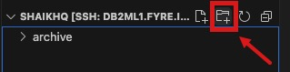

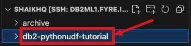
2. Right click on the project folder and click `Open in Integrated Terminal`.
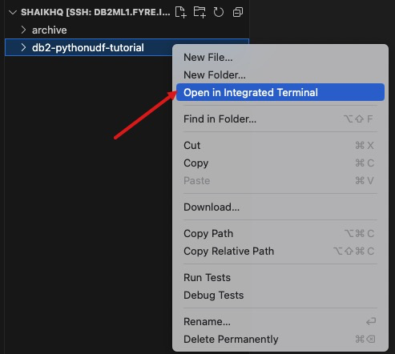

This will open the integrated terminal at VSCode at this project folder's path. 
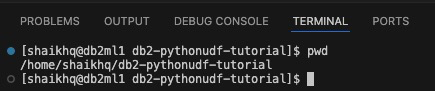

3. Create a Python virtual environment for this project. This virtual environment will isolate the python dependencies of this project. 
In the command prompt of the terminal, type the following command to create a python virtual environment for the project. For this exercise, I will create a python virtual environment using `venv`.

```shell
python3 -m venv .venv
```

This command will create a virtual environment in a subdirectory called `.venv`, inside the project directory. 

Activate your python virtual environment: 
```shell
source .venv/bin/activate
```

4. Press `Shift + Cmd + P` to bring up the option to set the project's Python interpreter. 
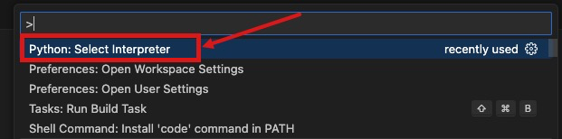

Click `Python: Select Interpreter` option. It will bring up a list of choices to select the Python interpreter. Click the option `Select interpreter path...`. Here either browse or type the path to your python3 interprter from the python virtual environment's folder. In my case, the path is: `/home/shaikhq/db2-pythonudf-tutorial/.venv/bin/python3`.

5. Create the following 2 text files: 

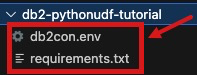

`db2con.env` file will have the connection information for the Db2 database. Here is the sample content for this file. This file has a list of key-value pair. For each key below, replace the sample value with the actual value for the target Db2 system.  
```
database=sample
hostname=localhost
port=25010
protocol=tcpip
uid=shaikhq
pwd=password
```

`requirements.tx` file has the list of python packages that this python package needs. For the current project, I will need the following list of packages. 
```
matplotlib
seaborn
scikit-image
jupyter
wget
QGRID
multiprocess
ibm_db
python-dotenv
scikit-learn
```

6. Install the required python packages from the terminal. 

```shell
pip install -r requirements.txt
```

## Build and Deploy a Scikit-learn Model with Db2
7. Create a Jupyter Notebook.
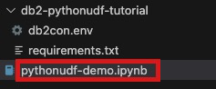

Set the Notebook's python Kernel to the python interpreter of the project's python virtual environment. In my setup, it looks as follows:

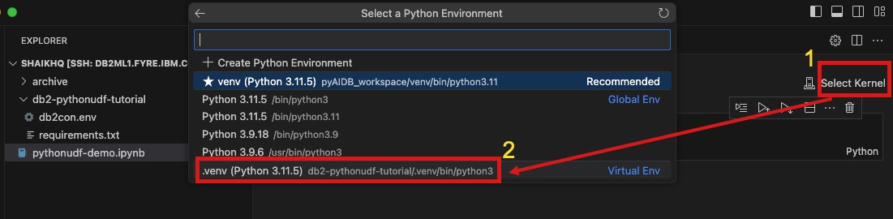

```python
!wget https://raw.githubusercontent.com/IBM/db2-jupyter/master/db2.ipynb
%run db2.ipynb
```

Once Db2 Magic Commands is successfully enabled, I got the following message: `Db2 Extensions Loaded.`
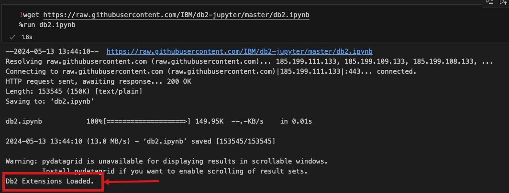


8. Load the db2 connection information from `db2con.env` and connect to Db2:
```python
db2creds = dotenv_values('db2con.env')
%sql CONNECT CREDENTIALS db2creds
```

If the connection to Db2 is successful, the following confirmation will show up: 
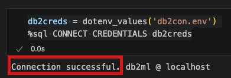


9. Bring the training dataset from the Db2 database to the Notebook:

```python
query = %sql SELECT * FROM FLIGHTS_TRAIN
df = pd.DataFrame(query)

cols_show = ['MONTH','DAYOFWEEK', 'UNIQUECARRIER', 'ORIGIN', 'DEST', 'DEPDELAY', 'FLIGHTSTATUS']

print('shape of the dataset: ', df.shape)

print('sample rows from the dataset:')
df[cols_show].sample(5)
```

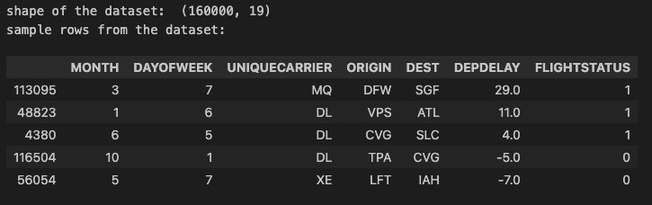

10. Define the ML training pipeline using the data preprocessing steps and the learning algorithm. 
```python
# Randomly split the dataset into 2 datasets: train and test sets. The test set has 20% of the original samples. 
# The remaining 80% of the samples remain with the train set. 
df_test = df.sample(frac=0.20)
df_train = df.drop(df_test.index)

# select the subset of columns as the input features for the ML model
input_cols = ['YEAR','QUARTER', 'MONTH',
                      'DAYOFMONTH', 'DAYOFWEEK','UNIQUECARRIER',
                      'ORIGIN', 'DEST', 'CRSDEPTIME',
                      'DEPDELAY', 'DEPDEL15','TAXIOUT','WHEELSOFF',
                      'CRSARRTIME', 'CRSELAPSEDTIME', 'AIRTIME', 'DISTANCEGROUP']

# select the class label, the target column, for the classification model
target = ['FLIGHTSTATUS']

X = df_train[input_cols]
y = df_train[target].astype('int')

# define the strategy to fill in missing values in the numeric columns
num_pipeline = make_pipeline(SimpleImputer(strategy='constant', fill_value=0), 
                            MaxAbsScaler())

# define the strategy to fill in missing values in the categorical columns
cat_pipeline = make_pipeline(SimpleImputer(strategy='most_frequent'),
                            OneHotEncoder(handle_unknown='ignore'))

# combine the previous 2 pipelines into a data preproessing pipeline. 

preprocessing = make_column_transformer(
    (num_pipeline, make_column_selector(dtype_include=np.number)),
    (cat_pipeline, make_column_selector(dtype_include='object'))
)

# create a final pipeline by chaining data preprocessing and a learning algorithm, `LogisticRegression`

pipe_lr = make_pipeline(preprocessing, 
                       LogisticRegression(random_state=1,
                                         solver='lbfgs'))
```

11. Train and evaluate the model.
```python
# train the model using the training set features and class labels
pipe_lr.fit(X, y)

# evaluate the trained model using the test set
X_test = df_test[input_cols]
y_test = df_test[target].astype('int')

predictions = pipe_lr.predict(X_test)

# compute the print the model accuracy

print('Accuracy: ', pipe_lr.score(X_test, y_test) * 100)
```
```
Accuracy:  87.171875
```


12. Re-train the model with the complete dataset
```python
pipe_lr.fit(df[input_cols], df[target].astype('int'))
```

13. Serialize and export the trained ML pipeline:
```python
dump(pipe_lr, 'myudf_lr.joblib')
```

14. Define the UDF code by copying the following code block into a new file with .py extension. For this exercise, name this new file `myudf_lr.py`.
```python

################
### IMPORTS ###
###############
import nzae

import pandas as pd
from joblib import load

ml_model_path = '/home/shaikhq/db2-pythonudf-tutorial/myudf_lr.joblib'
ml_model_features = ['YEAR', 'QUARTER', 'MONTH', 'DAYOFMONTH', 'DAYOFWEEK', 'UNIQUECARRIER', 'ORIGIN', 'DEST', 'CRSDEPTIME', 'DEPDELAY', 'DEPDEL15', 'TAXIOUT', 'WHEELSOFF', 'CRSARRTIME', 'CRSELAPSEDTIME', 'AIRTIME', 'DISTANCEGROUP']


class full_pipeline(nzae.Ae):
    def _runUdtf(self):
        #####################
        ### INITIALIZATON ###
        #####################
    
        trained_pipeline = load(ml_model_path)
        
        #######################
        ### DATA COLLECTION ###
        #######################
        # Collect rows into a single batch
        rownum = 0
        row_list = []
        for row in self:
            if (rownum==0):
                # Grab batchsize from first element value (select count (*))
                batchsize=row[0] 
            
            # Collect everything but first element (which is select count(*))
            row_list.append(row[1:])
            rownum = rownum+1
            if rownum==batchsize:
                ##############################
                ### MODEL SCORING & OUTPUT ###
                ##############################
                
                # Collect data into a Pandas dataframe for scoring
                data=pd.DataFrame(row_list,columns=ml_model_features)
                
                # Call our trained pipeline to transform the data and make predictions
                predictions = trained_pipeline.predict(data)
                
                # Output the columns along with the corresponding prediction
                for x in range(predictions.shape[0]):
                    outputs = []
                    for i in row_list[x]:
                        outputs.append(i)
                    if predictions.dtype.kind=='i':
                        outputs.append(int(predictions[x]))
                    else:
                        outputs.append(float(predictions[x]))
                    self.output(outputs)

                #Reset rownum and row_list for next batch
                row_list=[]
                rownum=0
        self.done()
full_pipeline.run()
```

Change the value of `ml_model_path` to the path in your system. This is the path where you have saved the serialized python model pipeline. 

15. Register the new UDF on Db2
Run the following SQL on Db2 to create this new Python UDF. 

```sql
CREATE OR REPLACE FUNCTION MYUDF_LR(
    INTEGER,
    INTEGER,
    INTEGER,
    INTEGER,
    INTEGER,
    INTEGER,
    VARCHAR(50),
    VARCHAR(50),
    VARCHAR(50),
    INTEGER,
    REAL,
    REAL,
    INTEGER,
    INTEGER,
    INTEGER,
    INTEGER,
    INTEGER,
    INTEGER
) 
RETURNS TABLE (
    "YEAR" INTEGER,
    "QUARTER" INTEGER,
    "MONTH" INTEGER,
    "DAYOFMONTH" INTEGER,
    "DAYOFWEEK" INTEGER,
    "UNIQUECARRIER" VARCHAR(50),
    "ORIGIN" VARCHAR(50),
    "DEST" VARCHAR(50),
    "CRSDEPTIME" INTEGER,
    "DEPDELAY" REAL,
    "DEPDEL15" REAL,
    "TAXIOUT" INTEGER,
    "WHEELSOFF" INTEGER,
    "CRSARRTIME" INTEGER,
    "CRSELAPSEDTIME" INTEGER,
    "AIRTIME" INTEGER,
    "DISTANCEGROUP" INTEGER,
    "FLIGHTSTATUS_PREDICTION" INTEGER
)
LANGUAGE PYTHON 
PARAMETER STYLE NPSGENERIC  
FENCED  
NOT THREADSAFE  
NO FINAL CALL  
DISALLOW PARALLEL  
NO DBINFO  
DETERMINISTIC 
NO EXTERNAL ACTION 
CALLED ON NULL INPUT  
NO SQL 
EXTERNAL NAME '/home/shaikhq/db2-pythonudf-tutorial/myudf_lr.py'
```

For this exercise, the only place in the above SQL you'll need to change is the path value in the EXTERNAL NAME part. Change it to path of the .py 
file where you have saved the UDF definition. 

16. Use the UDF to generate predictions from Db2. 
```sql
SELECT f.*
FROM FLIGHTS_TEST i, 
     TABLE(
         MYUDF_LR(
             (SELECT COUNT(*) FROM FLIGHTS_TEST),
             i."YEAR",
             i."QUARTER",
             i."MONTH",
             i."DAYOFMONTH",
             i."DAYOFWEEK",
             i."UNIQUECARRIER",
             i."ORIGIN",
             i."DEST",
             i."CRSDEPTIME",
             i."DEPDELAY",
             i."DEPDEL15",
             i."TAXIOUT",
             i."WHEELSOFF",
             i."CRSARRTIME",
             i."CRSELAPSEDTIME",
             i."AIRTIME",
             i."DISTANCEGROUP"
         )
     ) f


