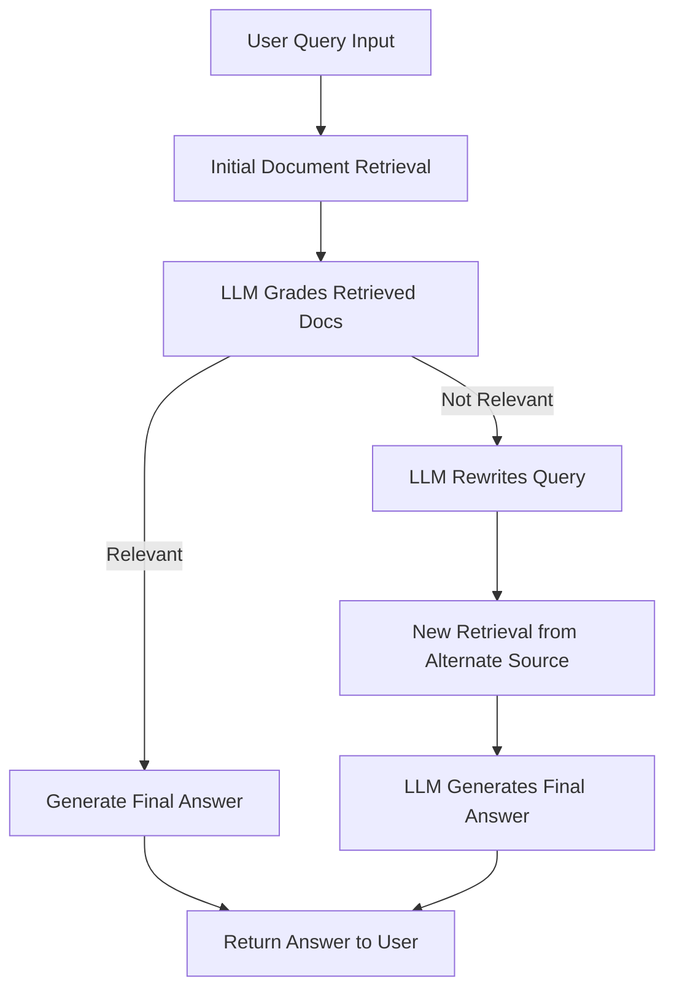

# 🔍 Local Agentic RAG Pipeline (macOS) – README

## 🎯 Use Case

This project implements a fully local, agentic RAG (Retrieval-Augmented Generation) pipeline using **LangGraph**. It is designed to:

* Run entirely on **macOS**, offline
* Use **local embeddings** with `llama.cpp`
* Perform **iterative query refinement** when initial retrieval fails
* Be clean, minimal, and beginner-friendly

The goal is to empower the LLM not just to answer, but to **reason**, **evaluate context**, and **rewrite queries** when needed.

---

## 🔁 Agentic RAG Workflow



This shows the *agentic loop*: query → retrieve → grade → optionally rewrite → final answer.

---

## 🙏 Acknowledgment

This project builds on the excellent LangChain tutorial:
🔗 [Agentic RAG with LangGraph](https://langchain-ai.github.io/langgraph/tutorials/rag/langgraph_agentic_rag/)

---

## ✨ What I’ve Added

Compared to the original tutorial, this project includes:

* **Local Embeddings** via `llama.cpp` – no cloud dependency
* **Cleaner Parsing** with `trafilatura` for robust HTML extraction
* **Smarter Chunking** using sentence-aware segmentation

---

# ⚙️ Setup Instructions (macOS)

## ✅ Create and Activate Virtual Environment

```bash
uv venv --python $(which python3.13)
source .venv/bin/activate
```

## 📦 Install Dependencies

```bash
uv pip install -r requirements.txt
```

## 🔐 Create `.env` File

```bash
touch .env
```

Add the following:

```
WATSONX_PROJECT=
WATSONX_APIKEY=
```

Replace values with your Watsonx credentials.

## 🧠 Install Language Model + spaCy

```bash
python -m ensurepip --upgrade
python -m spacy download en_core_web_sm
```

## ⬇️ Download Local Embedding Model

```bash
wget -O granite-embedding-30m-english-Q6_K.gguf \
  https://huggingface.co/lmstudio-community/granite-embedding-30m-english-GGUF/resolve/main/granite-embedding-30m-english-Q6_K.gguf
```

---

## 💻 Optional: VS Code + Jupyter Setup

### Install Jupyter
****
```bash
uv pip install jupyter ipykernel
```

### Register Jupyter Kernel

```bash
python -m ipykernel install --user --name=myenv --display-name "Python (.venv)"
```

### Set Up in VS Code

1. `Cmd + Shift + P` → **Python: Select Interpreter**
2. Press `Cmd + Shift + .` to show hidden `.venv` folder
3. Choose `.venv/bin/python`
4. `Cmd + Shift + P` → **Jupyter: Select Interpreter to Start Jupyter Server**
5. Choose the same `.venv` Python
6. If kernel doesn’t show:

   * Temporarily select a different one
   * Re-select `.venv`
   * Run `Developer: Reload Window`

---