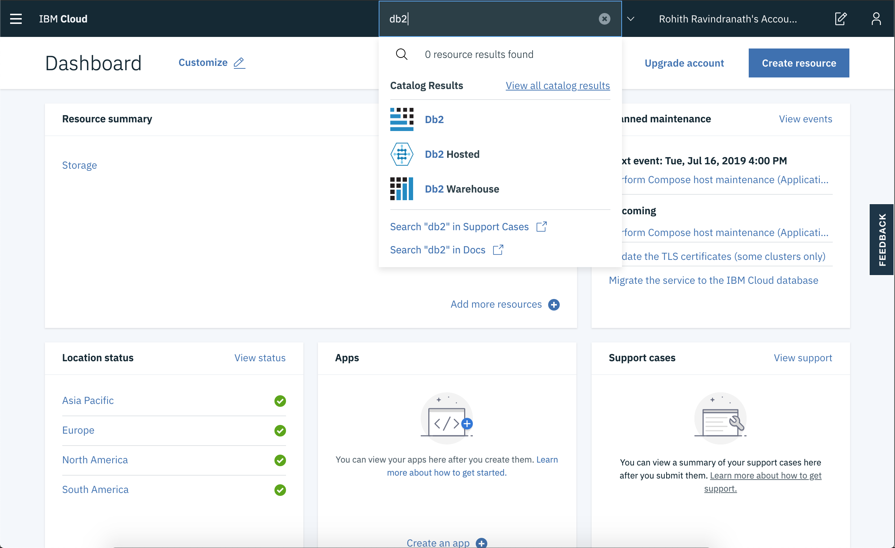
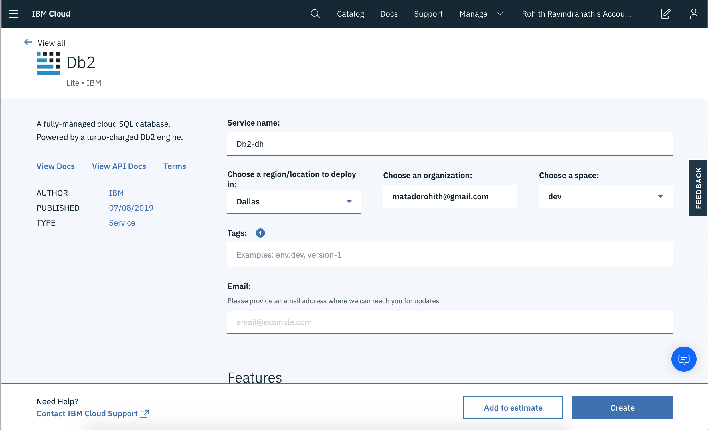
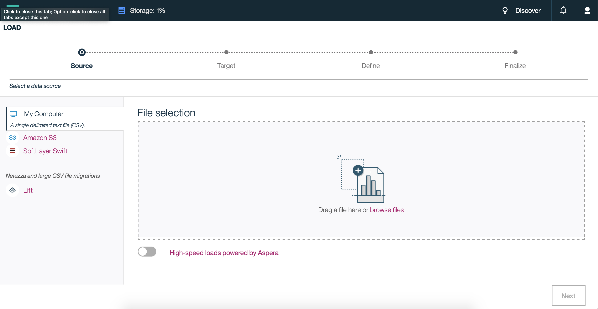

# Db2 Samples For Machine Learning 

Nowadays data scientists and data engineers have to collect, handle, and analyze huge sets of data. These huge sets of data allow companies and teams to make valuable and educated predictions and decisions for their buisness. However, these data sets are so huge that they won't fit in on your computer, or the script may take a long time to run. Due to this, these datasets are being stored in databases such as Db2 on Cloud that allows companies to hold huge datasets and run models much more quickly and scale at an alarming rate. 

In these three notebooks, we will be demonstrating how programmers can use Db2 as a data source when creating machine learning models with huge data sets. Each notebook talks about how Db2 can be used with a specific popular machine learning libarary- `sklearn`, `h2o`, and `tensorflow`.

Before you start using these notebooks, make sure you have created a Db2 On Cloud instance.

Below will give instructions on how to create Db2 on Cloud instance.

### 1. Create an IBM Cloud account

Create a free IBM on Cloud Account if you don't already have one using the following link:

[IBM Cloud](https://cloud.ibm.com)

Creating this account will give us access to `Db2 on Cloud` service.

### 2. Load data into IBM Db2 on Cloud

Now that we have created our IBM Cloud account. We need to create a Db2 on Cloud service. Once we have create that, we will then we able to load our data into our database.

1. [Create Db2 on Cloud Service](#2a-create-db2-on-cloud-service)
2. [Load Data into Db2 on Cloud](#2b-load-data-into-db2-on-cloud)

#### 2a. Create Db2 on Cloud Service

Go to the [dashboard](https://cloud.ibm.com) of your IBM Cloud account and the follow the steps to create your Db2 On Cloud service.

* In the search bar at the top of your dashboard, search `Db2`.
* Although there are different database options to choose from, for the purposes of this tutorial we will be using the the `Db2` option. Click `Db2` when that option appears in the search bar.

* For the service name, enter in `Data-Science-Track`.
* Make sure you pick the region that is closest to where you currently reside.
* Scroll down to the `Pricing Plan` section and choose the `Lite` plan.
* Click `Create`

>NOTE: You will be only able to create one instance per account.

Once you have created your database instance, we can go back to the dashboard and click on the `View Resources` link under the `Resource Summary` section. You should then be able to see and verify that your Db2 instance has been created under the `Cloud Foundry Services` tab.  

#### 2b. Load Data into Db2 on Cloud

Go to the dashboard of your IBM Cloud account and the follow the steps to load your data onto Db2 On Cloud service.

* In the search bar, search `Data-Science-Track` and click on your Db2 on Cloud service

* Click on `Open Console` which will direct you to the Db2 on Cloud Console.
* Click on `Load` under the Hamburger menu.
* Click on `browse files` and select `data/wine.csv` if you are using `Db2 Sample For Tensorflow.ipynb` OR `data/winequality-red.csv` for the other two notebooks
* Click `Next`.

* The next step is to decide where our data will be stored. Click on the first schema that shows up, then select `New Table`.
* Give a name to our table name and select `Create` and finally `Next`.
* Make sure the column names and datatypes are correct, and click `Next`.
* Click `Begin Load`.

Once the job has been completed, our data has finally been loaded into our database.

## License

This code pattern is licensed under the Apache License, Version 2. Separate third-party code objects invoked within this code pattern are licensed by their respective providers pursuant to their own separate licenses. Contributions are subject to the [Developer Certificate of Origin, Version 1.1](https://developercertificate.org/) and the [Apache License, Version 2](https://www.apache.org/licenses/LICENSE-2.0.txt).

[Apache License FAQ](https://www.apache.org/foundation/license-faq.html#WhatDoesItMEAN)