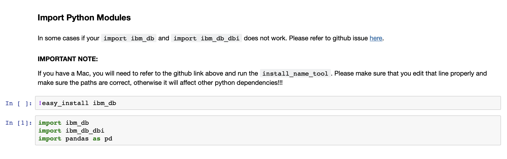
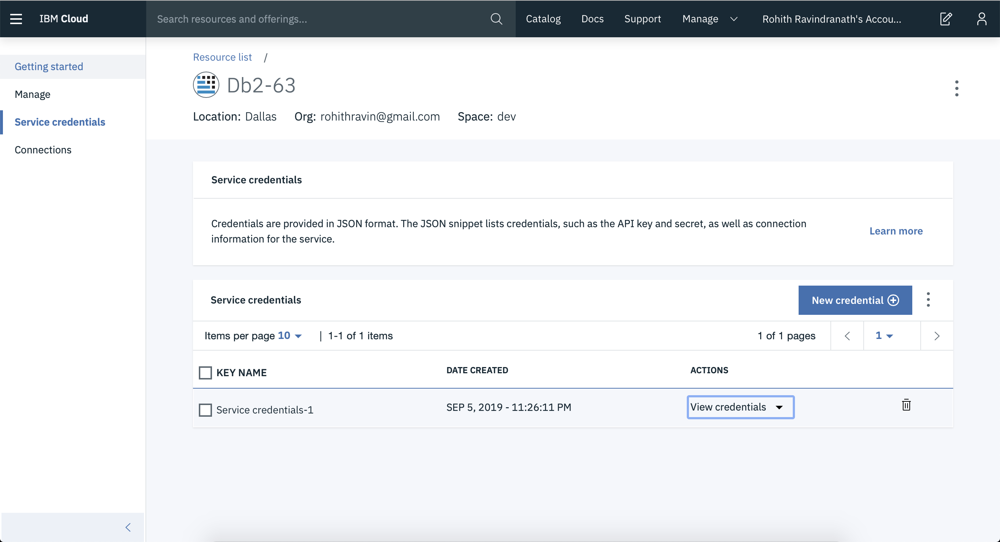
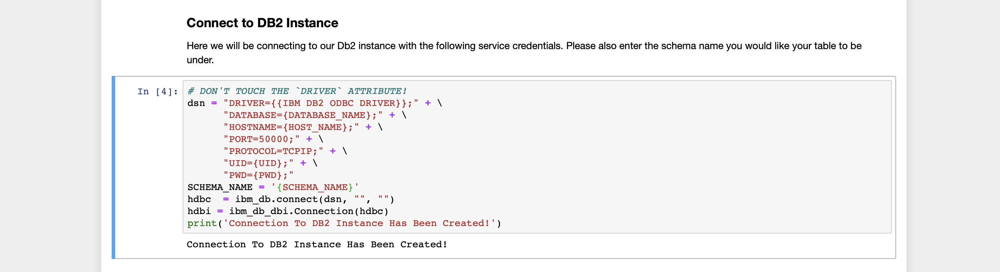
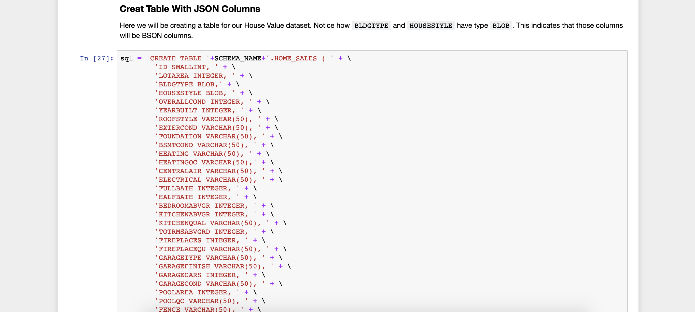
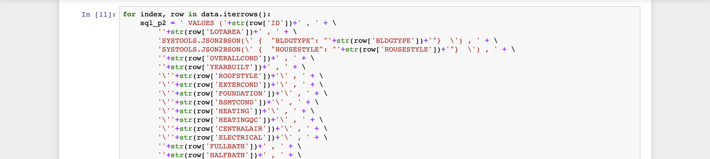
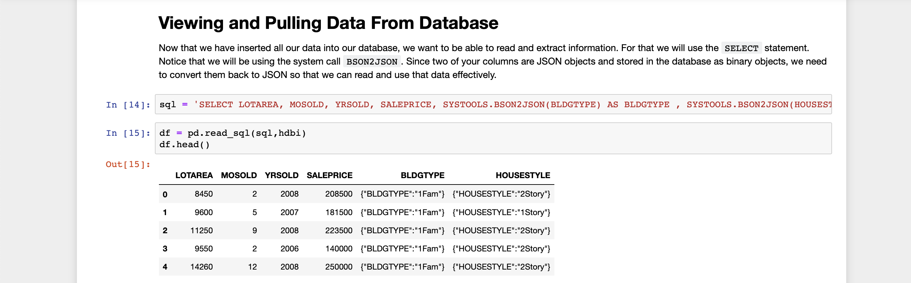
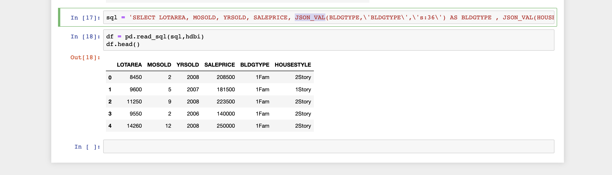

# Db2 with JSON Documents 

In this sample, we will be going over the JSON features in Db2. We will be creating a table with some columns represented by JSON documents, and we will also demonstrate how to store and retrieve such information.

## 1. Setting Up Enviroment
In order to run our code, we will be using `Jupyter Notebook`. If you don't have Jupyter Notebook installed, you can either download it from the Anaconda Distribution or use `pip install`. The links are provided below.

1. [Anaconda Distribution](https://www.anaconda.com/distribution/)
2. [Installing Using Pip](https://jupyter.org/install)

After successfully installing Jupyter Notebook, we can open it and create a new notebook. You may also download the demo notebook created for you under the `notebook/` folder. 

## 2. Importing Libraries

Before we start communicating with our database, we need to import certain libraries that will aid us in communicating. 

We will be importing two libraries- `ibm_db` and `ibm_db_dbi`. ibm_db is a library with low-level functions that will directly connect to our db2 database. To make things easier for you, we will be using ibm-dbi, which communicates with ibm-db and gives us an easy interface to interact with our data and import our data as a pandas dataframe.

## 3. Establishing a Connection

We now need to establish a connection to our Db2 instance which will be used to store our data for this notebook. For this demo we used Db2 on Cloud, however, any Db2 instance will work. 

In order to create a connection with our Db2 instance, we need to aquire the service credentials. For Db2 on Cloud, this can be found on your IBM Cloud account. 

On our IBM Cloud account, if you search your Db2 instance name and head to the `Service Crendtials` tab, you will see the credentials that can be used to connect to your instance. If there isn't one that exits, click the `New Credentials` button to create one. 

Now that we have our credentials, lets head back to our notebook and input that information. 

Make sure to input the correct credential values to the corresponding label. If you have successfully connected to your Db2 instance, you will see the success message at the bottom of the picture, if not, and error message will pop up.

***NOTE: YOU WILL ALSO NEED THE SCHEMA NAME TO CREATE THE TABLE. MAKE SURE YOU ALSO INPUT THAT INFORMATION IN THE `SCHEMA_NAME` LINE*** 

## 4. Creating a Table

We will now be creating a table to store our data. The data we will be using is the `House_Value` dataset that can be found in the `data` folder. When we create our table using SQL, notice how `BLDGTYPE` and `HOUSESTYLE` have type `BLOB`, while the other columns have normal data types. By stating a specific column to be type `BLOB`, we are telling our DBMS that these columns will hold JSON documents. This is the first step in creating a table that has the capability of storing normal data and JSON data.

## 5. Inserting Data

Now that our table has been created, we can now add data to it. As mentioned before, the data we will be using is the `House_Value` dataset that can be found in the `data` folder.

As you can see in the picture, as we go through each row extracting data from each column, we are creating one big SQL statement that will be executed. Most importantly, `BLDGTYPE` and `HOUSESTYLE` data is being wrapped into a JSON document. This is because we specified in our `INSERT` statement that both of these columns will store JSON data. We will also need to make a system call - `SYSTOOLS.JSON2BSON()` - which will convert our data in [BSON](https://en.wikipedia.org/wiki/BSON). This new BSON is what is going to be stored in our database, thereby increasing efficiency. 

## 6. Retrieving Data

When trying to extract JSON data from our database we will be using the system call - `SYSTOOLS.BSON2JSON()`. Since we stored our data as BSON, we need to convert it back to JSON so that we are able to understand what we stored. In the picture below, you can see the system call in action as well as how the JSON object appears in the table when we print the result of our SQL statement.

However, sometimes you may only want to retrieve a certain attribute within the JSON object instead of the entire object. For this purpose, we will have to use the system call `JSON_VAL()`. This will give us the specific attribute/value that we specify in the JSON object. 

## License

This code pattern is licensed under the Apache License, Version 2. Separate third-party code objects invoked within this code pattern are licensed by their respective providers pursuant to their own separate licenses. Contributions are subject to the [Developer Certificate of Origin, Version 1.1](https://developercertificate.org/) and the [Apache License, Version 2](https://www.apache.org/licenses/LICENSE-2.0.txt).

[Apache License FAQ](https://www.apache.org/foundation/license-faq.html#WhatDoesItMEAN)

